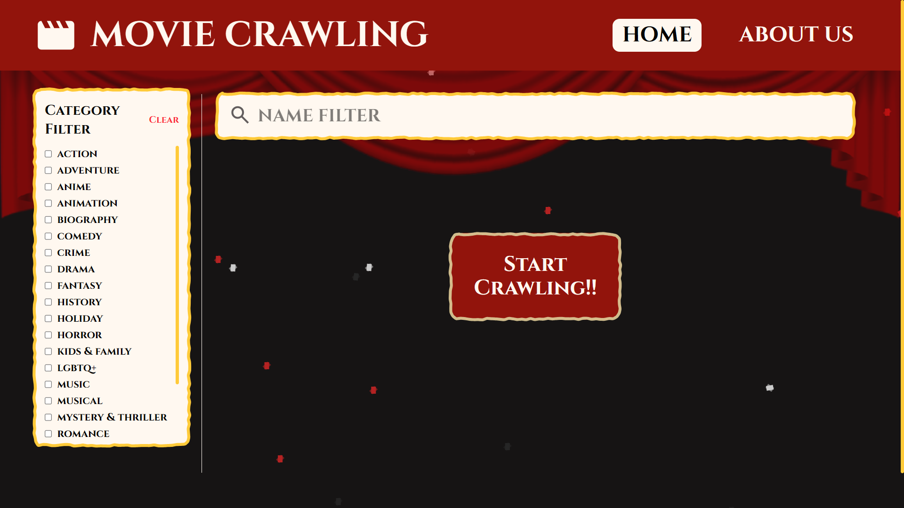
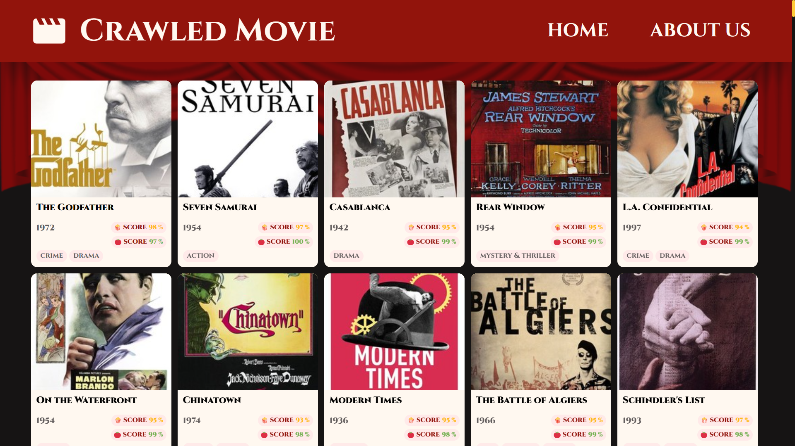
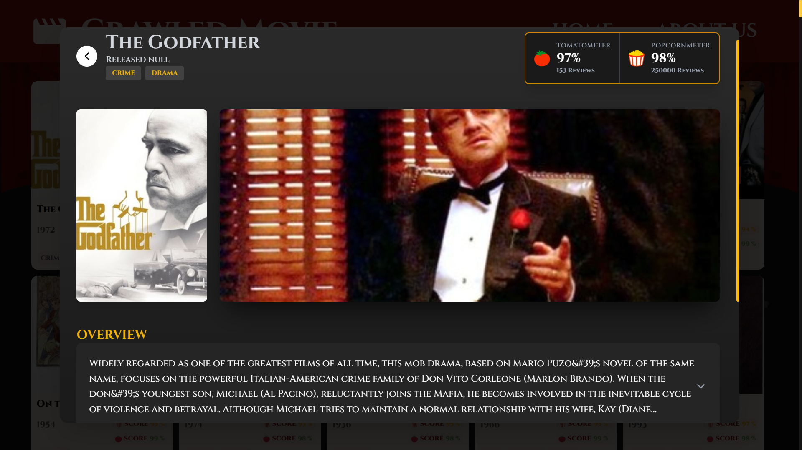

# 📽️ Movie Crawler
A web application that crawls movie data from Rotten Tomatoes and displays detailed information including ratings, casts, and more, allowing users to search and filter movies.

## 🖼️ Demo
#### 📺 Demo Video  
[](https://youtu.be/rw504A-p540)





## 🛠️ Tech Stack
- React
- Typescript
- Vite
- Tailwind CSS

## ✨ Features
- **Crawl Movies** - Crawl movies according to search filters.
- **Movie Details** - View movie overview, ratings from websites and top casts.
- **Export to CSV** - Export crawled movies to csv file.

## 🔧 Installation
1. Clone the repository  
   ```bash
   git clone https://github.com/jueeeeeen/Movie-Crawler-frontend.git
   ```
2. Navigate into the frontend folder
    ```bash
   cd Movie-Crawler-frontend
   ```
3. Install dependencies
    ```bash
   npm install
   ```
## 🔗 Backend API
>This frontend works with the backend API available at:
>https://github.com/SrmxKub/TopMoviesCrawler_Backend

## 🚀 How to Run
1. Run the project
    ```
    npm run dev
    ``` 
2. Open your browser and visit

    ```
    http://127.0.0.1:5173/
    ```